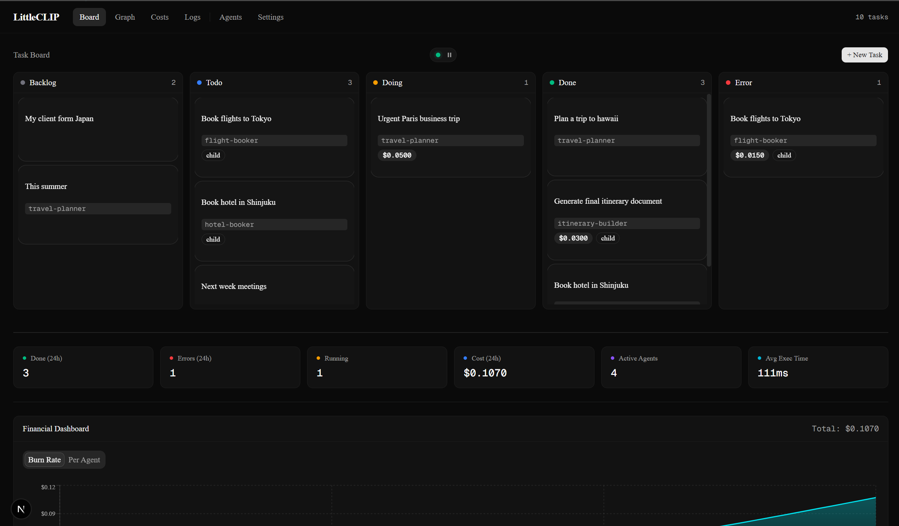
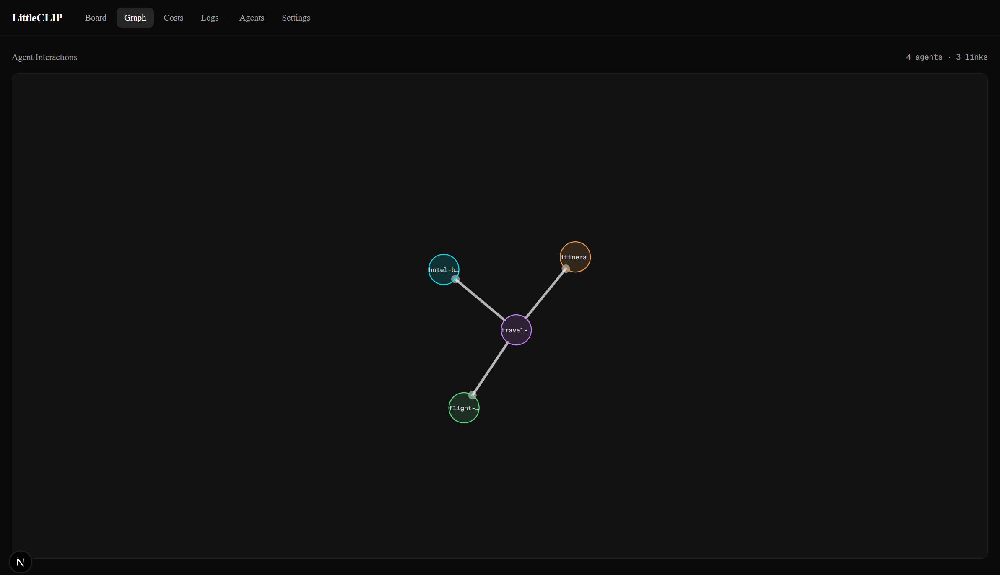
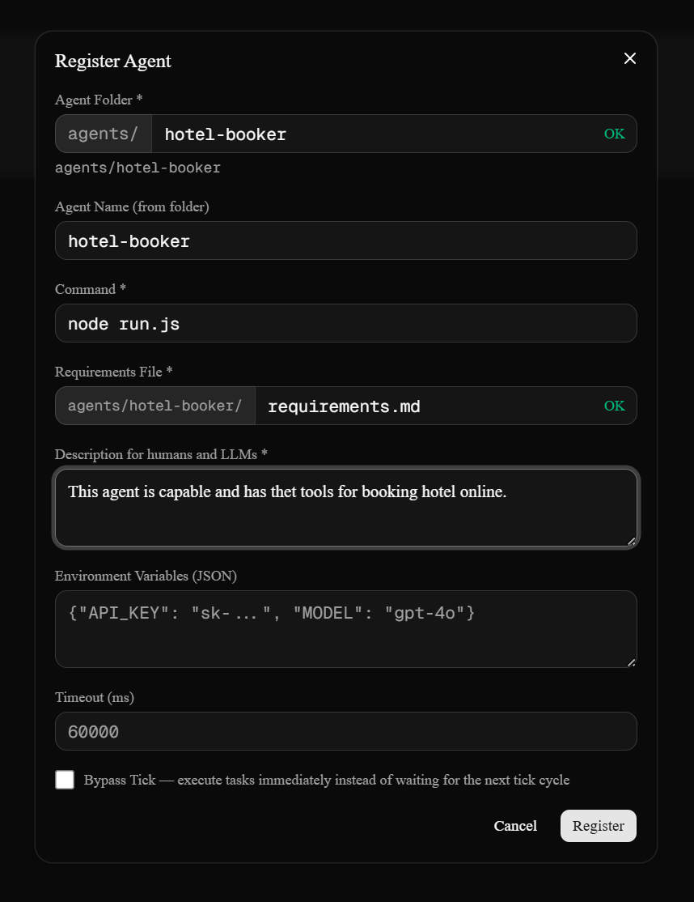

# LittleCLIP

LittleCLIP is a lightweight multi-agent system (MAS) orchestrator and monitoring tool.

It provides a Kanban-based UI for managing agent workflows, real-time execution logs, a communication graph, and basic cost metrics.

<table>
  <tr>
    <td></td>
    <td></td>
  </tr>
</table>

Agents are process-based: the orchestrator spawns each agent as a child process, writes a JSON input to its stdin, and reads its JSON output from stdout.

This means agents can be written in any language (Node.js, Python, C#, Bash, etc.) with zero coupling to the orchestrator codebase.

This repository contains only the orchestrator framework. It does not ship any agents. It is designed for developers who want to build and orchestrate their own multi-agent systems of any kind.

<strong>A `SKILL.md` file is included at `.cursor/skills/crafting-mas-agents/SKILL.md` to give your code assistant full context on how to build agents for LittleCLIP.</strong>

## Requirements

- Node.js v20 or later
- npm, yarn, or pnpm

## Getting Started

```bash
npm install
npx drizzle-kit push
npm run dev
```
## Registering Your First Agent



1. Create an `agents/` folder at the project root.
2. Inside it, create a folder for your agent. The folder name becomes the agent name (e.g. `agents/my-agent/`).
3. Add your executable script (e.g. `run.js`, `run.py`) and any dependency file your agent needs (`package.json`, `requirements.txt`, etc.).
4. In the UI, navigate to the **Agents** page and click **Register Agent**.
   - **Path** — working directory for the process (project root by default).
   - **Command** — the shell command to run the agent (e.g. `node agents/my-agent/run.js` or `python agents/my-agent/run.py`).
   - **Description** — a one-line summary. This description is provided to all other agents so they know when to delegate tasks to yours.

Once registered, the agent is ready to receive tasks.

## Agent Contracts

Agents have exactly two touchpoints with LittleCLIP: an **input** JSON (delivered via stdin) and an **output** JSON (printed to stdout).

### AgentInput (delivered via stdin)

The orchestrator writes a single UTF-8 JSON document to the agent's stdin. For local debugging you may also pass the same JSON as a CLI argument (`process.argv[2]` in Node.js, `sys.argv[1]` in Python).

```json
{
  "task_id": "01J5KXYZ...",
  "task_body": "The task instructions written by a human or parent agent",
  "system_prompt": "Shared orchestration prompt from the settings page",
  "parent_context": [
    {
      "id": "01J5KX...",
      "title": "Parent task title",
      "body": "Parent task body",
      "output": "Parent task output (null if not yet completed)",
      "agent": "coordinator"
    }
  ],
  "child_tasks": [
    {
      "id": "01J5KY...",
      "title": "Previously created sub-task",
      "body": "Sub-task instructions",
      "status": "done",
      "output": "Sub-task result",
      "agent": "worker"
    }
  ],
  "sibling_tasks": [
    {
      "id": "01J5KZ...",
      "title": "Sibling task under the same parent",
      "body": "Sibling instructions",
      "status": "done",
      "output": "Sibling result",
      "agent": "researcher"
    }
  ],
  "available_agents": [
    { "name": "coordinator", "description": "High-level strategist" },
    { "name": "worker", "description": "Executes concrete tasks" }
  ]
}
```

| Field | Type | Description |
|---|---|---|
| `task_id` | string | ULID of the current task |
| `task_body` | string | The task instructions |
| `system_prompt` | string | Shared system prompt (configurable in settings) |
| `parent_context` | array | Ancestor task chain, nearest parent first (up to 10). Body and output fields may be truncated |
| `child_tasks` | array | Up to 20 most recent sub-tasks with their current status and output. Body and output fields may be truncated |
| `sibling_tasks` | array | Other tasks sharing the same parent (up to 20 most recent, excludes self) |
| `available_agents` | array | All registered agents with name and description |

### AgentOutput (printed to stdout)

The agent must print a valid JSON object to stdout. The orchestrator extracts the **last** JSON object from the full stdout stream, so debug logs before it are fine.

```json
{
  "output": "Summary of what the agent accomplished",
  "cost": 0.003,
  "status": "done",
  "next_tasks": [
    {
      "title": "Sub-task title",
      "body": "Detailed instructions for the sub-task",
      "agent": "worker",
      "status": "todo"
    }
  ]
}
```

| Field | Type | Required | Description |
|---|---|---|---|
| `output` | string | yes | Result summary visible to parent agents and humans |
| `cost` | number | no | Incremental execution cost in dollars (e.g. LLM API cost). The orchestrator accumulates this across re-invocations. Defaults to `0` |
| `status` | string | recommended | Controls the task's final status. Valid values: `"done"` (default), `"doing"`, `"error"`. LLM-driven agents should always set this explicitly. `"doing"` keeps the task alive for re-invocation without children. When `next_tasks` are present, the orchestrator overrides to `"doing"`. Defaults to `"done"` if omitted |
| `next_tasks` | array | no | Sub-tasks to create. Omit or pass `[]` when the work is complete |
| `next_tasks[].title` | string | yes | Task card title |
| `next_tasks[].body` | string | no | Detailed specification for the sub-task |
| `next_tasks[].agent` | string or null | no | Agent name to assign (must match a name from `available_agents`) |
| `next_tasks[].status` | string | no | `"todo"` when an agent is assigned, `"backlog"` when agent is null |

## Minimal Agent Examples

### Node.js

```javascript
async function readInput() {
  const fromArg = process.argv[2];
  if (fromArg) return fromArg;
  const chunks = [];
  for await (const chunk of process.stdin) chunks.push(chunk);
  return Buffer.concat(chunks).toString("utf8");
}

(async () => {
  const input = JSON.parse(await readInput());
  const { task_body, child_tasks, available_agents } = input;

  // Your logic here

  const result = {
    output: "What this agent accomplished",
    cost: 0,
    // status: "done",  -- optional, defaults to "done"
  };

  console.log(JSON.stringify(result));
})();
```

## Tick System

The orchestrator runs on a configurable tick interval. On each tick, all tasks with status `"todo"` are picked up and executed. The tick interval can be adjusted in the **Settings** page (default: 10 seconds).

Agents with the **Bypass Tick** option enabled will have their child tasks executed immediately after creation, without waiting for the next tick. This is useful for fast-running agents in tight delegation chains.

### Retrigger Parent

Agents with the **Retrigger Parent** option enabled cause the runner to immediately re-invoke the parent task once all sibling tasks reach a terminal state (`done` or `error`), without waiting for the next tick. Combined with Bypass Tick on the parent, this enables fully synchronous delegation chains where no tick latency is introduced between rounds.

## Task Lifecycle

```
todo ──> runner spawns agent ──> agent prints AgentOutput
                                        |
                           +────────────┴────────────+
                      has next_tasks            no next_tasks
                           |                        |
                     stays "doing"       uses agent-provided status
                           |               (default: "done")
               children execute...
                           |
               all children reach terminal state
                           |
                   agent re-invoked  <── with child_tasks populated
                           |
                    (loop continues until agent returns no next_tasks)
```

- Returning `next_tasks` keeps the task in `"doing"` and triggers a re-invocation loop — the orchestrator overrides the agent's `status` to `"doing"` when children are present.
- When there are no `next_tasks`, the orchestrator uses the agent-provided `status` field. If omitted, it defaults to `"done"`.
- An agent can return `status: "error"` to self-report failure even on exit code 0, or `status: "doing"` with no children to keep itself alive for external re-invocation.
- The agent is re-invoked with `child_tasks` populated once all sub-tasks reach a terminal state (`done` or `error`). If a child agent has **Retrigger Parent** enabled, re-invocation happens immediately; otherwise it occurs on the next tick.
- The agent **must** eventually return with no `next_tasks` to complete, otherwise it loops indefinitely.
- Exit code `0` means success. Any non-zero exit code marks the task as `"error"`.
- Cost reported by each invocation is accumulated by the runner across re-invocations.

### Task Statuses

`backlog` → `todo` → `doing` → `done` | `error`

| Status | Meaning |
|---|---|
| `backlog` | Created but no agent assigned |
| `todo` | Agent assigned, waiting for the next tick |
| `doing` | Currently being executed or waiting on sub-tasks |
| `done` | Completed successfully |
| `error` | Failed (non-zero exit, parse error, or timeout) |

## Rate Limiting

A chain-call limit prevents runaway loops. The global default is 10 calls per minute (configurable via the `max_chain_calls_per_minute` setting). Each agent can also override this with its own **Max Chain Calls / min** value in the agent configuration. If an agent's delegation chain exceeds its limit, new child tasks are created with `"error"` status and the chain is broken.

## Agent Rules Summary

1. Read the `AgentInput` JSON from stdin. For local debugging you may also pass it as `argv[2]` (Node.js) or `argv[1]` (Python).
2. Print the `AgentOutput` JSON as the **last thing** to stdout. The orchestrator extracts the last valid JSON object from the full output.
3. Debug logs are fine — print anything you want before the final JSON. The orchestrator only parses the last JSON object.
4. Exit with code `0` for success. Non-zero marks the task as `"error"`.
5. Never import orchestrator code. Agents are standalone processes. All context arrives via the JSON input.
6. Environment variables from the agent's configuration are injected at spawn time. Use them for API keys. The `TASK_ID` env var is also injected automatically.
7. Default timeout is 60 seconds, configurable per agent.

## Tech Stack

- **Next.js** — full-stack React framework (app router)
- **SQLite** via better-sqlite3 — local database acting as the system ledger
- **Drizzle ORM** — type-safe, code-first database schema and queries
- **Tailwind CSS** — utility-first styling
- **Recharts** and **D3** — metrics and agent communication graph

## Contributing

Feel free to fork, reuse, and submit change request.

## License
MIT
