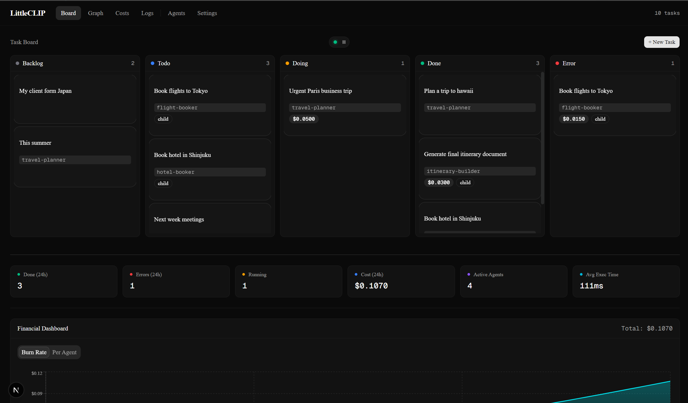
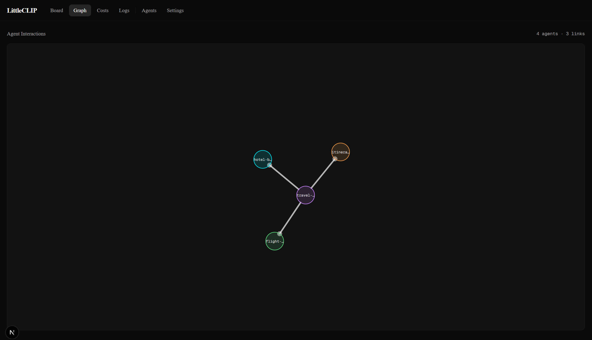
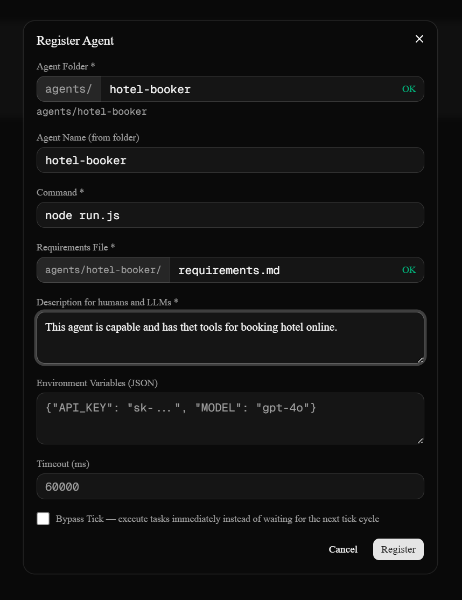

# LittleCLIP

LittleCLIP is a lightweight multi-agent system (MAS) orchestrator and monitoring tool.

It provides a Kanban-based UI for managing agent workflows, real-time execution logs, a communication graph, and basic cost metrics.


|                                  |                          |
| -------------------------------- | ------------------------ |
|  |  |


Agents are process-based: the orchestrator spawns each agent as a child process, writes a JSON input to its stdin, and reads its JSON output from stdout.

This means agents can be written in any language (Node.js, Python, C#, Bash, etc.) with zero coupling to the orchestrator codebase.

This repository contains only the orchestrator framework. It does not ship any agents. It is designed for developers who want to build and orchestrate their own multi-agent systems of any kind.

**A `SKILL.md` file is included at `skill/SKILL.md` to give your code assistant full context on how to build agents for LittleCLIP.**

## How it works

LittleCLIP sends an `AgentInput` (see below) to your agent containing context about the current task, parent tasks, sibling tasks, and available agents. The agent uses this information to perform its work.

In return, LittleCLIP expects an `AgentOutput` (see below) to handle the next steps. Through this, agents can:

- Assign tasks to each other
- Wait for sub-tasks to finish before continuing the main task
- Complete their own tasks
- Update their own task status


## Requirements

- Node.js v20 or later
- npm, yarn, or pnpm


## Getting Started

### 1. Install dependencies

```bash
npm install
# or: pnpm install / yarn install
```

> **Note for pnpm users**: `better-sqlite3` is a native binary module compiled during installation. It is already pre-configured in `package.json` under `pnpm.onlyBuiltDependencies`.

### 2. Database Setup (SQLite & Drizzle ORM)

LittleCLIP uses a local SQLite database file (`lite-clip.db` at the repository root) managed via **Drizzle ORM** and **better-sqlite3** with WAL mode enabled.

To create the SQLite database and initialize all required tables (`tasks`, `agents`, `settings`), apply the migration files from the `drizzle/` directory:

```bash
npm run db:migrate
# or: pnpm db:migrate
```

This will automatically create `lite-clip.db` if it does not exist yet.

#### Database Scripts

The following database scripts are provided in `package.json`:

| Command | Tool Command | Description |
| ------- | ------------ | ----------- |
| `npm run db:migrate` | `drizzle-kit migrate` | Applies all pending migrations from `./drizzle` to `lite-clip.db` |
| `npm run db:generate` | `drizzle-kit generate` | Generates new SQL migration files in `./drizzle` from `src/db/schema.ts` |
| `npx drizzle-kit push` | `drizzle-kit push` | Pushes the schema from `src/db/schema.ts` directly into `lite-clip.db` without generating migration files (useful for prototyping) |

### 3. Start the Development Server

```bash
npm run dev
# or: pnpm dev
```

Open [http://localhost:3000](http://localhost:3000) in your browser to access the dashboard.


## Registering Your First Agent



1. Create an `agents/` folder at the project root.
2. Inside it, create a folder for your agent. The folder name becomes the agent name (e.g. `agents/my-agent/`).
3. Add your executable script (e.g. `run.js`, `run.py`) and any dependency files your agent needs (`package.json`, `requirements.txt`, etc.).
4. In the UI, navigate to the **Agents** page and click **Register Agent**.
  - **Path** — working directory for the process (project root by default).
  - **Command** — the shell command to run the agent (e.g. `node agents/my-agent/run.js` or `python agents/my-agent/run.py`).
  - **Description** — a one-line summary. This description is provided to all other agents so they know when to delegate tasks to yours.
  - **Bypass Tick** (optional) — child tasks assigned to this agent run immediately upon creation instead of waiting for the next scheduler tick.
  - **Retrigger Parent** (optional) — immediately re-invokes the parent task when all sibling tasks finish (`done` or `error`), without waiting for the next tick.
  - **Max Chain Calls / min** (optional) — per-agent execution rate limit (falls back to global project setting).
  - **Timeout** (optional) — execution timeout in milliseconds (defaults to 60,000 ms / 60 seconds).
  - **Environment Variables** (optional) — JSON object of custom environment variables injected into the agent process at runtime (the `TASK_ID` env var is always injected automatically).

Once registered, the agent is ready to receive tasks.

## Tick System & Execution Lifecycle

The orchestrator executes tasks through an automated tick engine with real-time UI synchronization:

- **Configurable Tick Interval**: Runs on a configurable interval (default: 10 seconds, adjustable in the **Settings** page). On each tick, all tasks with status `"todo"` are scheduled and executed.
- **Server Lifecycle Hook**: The engine starts cleanly on server initialization via Next.js `instrumentation.ts`.
- **Supervisory Watchdog**: A background watchdog monitors scheduled ticks every 60 seconds to detect and recover from timer stalls or clock drift, automatically rescheduling overdue cycles.
- **Live UI Synchronization**: The dashboard header displays an active countdown (`14s`, `2m 10s`, or `now`) synced with `getTickState()`, accompanied by an interactive play/pause toggle.
- **Manual Execution**: Any assigned task can also be triggered immediately on demand via the **Run** button in the task detail dialog, without waiting for the next tick.


### Fast Execution Loops

- **Bypass Tick**: Agents with **Bypass Tick** enabled have their child tasks executed immediately upon creation, eliminating scheduler latency in multi-step workflows.
- **Retrigger Parent**: Agents with **Retrigger Parent** enabled cause the orchestrator to immediately re-invoke the parent task once all sibling tasks reach a terminal state (`done` or `error`), without waiting for the next tick. Combining Bypass Tick on the parent with Retrigger Parent on workers enables fully synchronous delegation round-trips.


## Task Lifecycle

```
todo ──> runner spawns agent ──> agent prints AgentOutput
                                        |
                           +────────────┴────────────+
                      has next_tasks            no next_tasks
                           |                        |
                     stays "doing"       uses agent-provided status
                           |               (default: "done")
               children execute...
                           |
               all children reach terminal state
                           |
                   agent re-invoked  <── with child_tasks populated
                           |
                    (loop continues until agent returns no next_tasks)
```

- Returning `next_tasks` keeps the task in `"doing"` and triggers a re-invocation loop — the orchestrator overrides the agent's `status` to `"doing"` when children are present.
- When there are no `next_tasks`, the orchestrator uses the agent-provided `status` field. If omitted, it defaults to `"done"`.
- An agent can return `status: "error"` to self-report failure even on exit code 0, or `status: "doing"` with no children to keep itself alive for external re-invocation.
- The agent is re-invoked with `child_tasks` populated once all sub-tasks reach a terminal state (`done` or `error`). If a child agent has **Retrigger Parent** enabled, re-invocation happens immediately; otherwise it occurs on the next tick.
- The agent **must** eventually return with no `next_tasks` to complete, otherwise it loops indefinitely.
- Exit code `0` means process success. Any non-zero exit code marks the task as `"error"`.
- Incremental cost reported by each invocation is accumulated by the runner into the task's total cost (`totalCost = previousCost + incrementalCost`).


### Task Statuses

`backlog` → `todo` → `doing` → `done` | `error`


| Status    | Meaning                                                             |
| --------- | ------------------------------------------------------------------- |
| `backlog` | Created but no agent assigned                                       |
| `todo`    | Agent assigned, waiting for execution (tick, manual run, or bypass) |
| `doing`   | Currently running or waiting on sub-tasks                           |
| `done`    | Completed successfully                                              |
| `error`   | Failed (non-zero exit code, unparseable output, or timeout)         |


## Agent Contracts

Agents have exactly two touchpoints with LittleCLIP: an **input** JSON (delivered via stdin) and an **output** JSON (printed to stdout).

### AgentInput (delivered via stdin)

The orchestrator writes a single UTF-8 JSON document to the agent's stdin (preventing OS command-line argument length limits such as `ENAMETOOLONG` on Windows). For local debugging, you may also pass the same JSON as a CLI argument (`process.argv[2]` in Node.js, `sys.argv[1]` in Python).

```json
{
  "task_id": "01J5KXYZ...",
  "task_body": "The task instructions written by a human or parent agent",
  "system_prompt": "Shared orchestration prompt from the settings page",
  "parent_context": [
    {
      "id": "01J5KX...",
      "title": "Parent task title",
      "body": "Parent task body",
      "output": "Parent task output (null if not yet completed)",
      "agent": "coordinator"
    }
  ],
  "child_tasks": [
    {
      "id": "01J5KY...",
      "title": "Previously created sub-task",
      "body": "Sub-task instructions",
      "status": "done",
      "output": "Sub-task result",
      "agent": "worker"
    }
  ],
  "sibling_tasks": [
    {
      "id": "01J5KZ...",
      "title": "Sibling task under the same parent",
      "body": "Sibling instructions",
      "status": "done",
      "output": "Sibling result",
      "agent": "researcher"
    }
  ],
  "available_agents": [
    { "name": "coordinator", "description": "High-level strategist" },
    { "name": "worker", "description": "Executes concrete tasks" }
  ]
}
```


| Field              | Type   | Description                                                                                                  |
| ------------------ | ------ | ------------------------------------------------------------------------------------------------------------ |
| `task_id`          | string | ULID of the current task                                                                                     |
| `task_body`        | string | The task instructions                                                                                        |
| `system_prompt`    | string | Shared system prompt (configurable in settings)                                                              |
| `parent_context`   | array  | Ancestor task chain, nearest parent first (up to 10). Body and output fields may be truncated                |
| `child_tasks`      | array  | Up to 20 most recent sub-tasks with their current status and output. Body and output fields may be truncated |
| `sibling_tasks`    | array  | Other tasks sharing the same parent (up to 20 most recent, excludes self)                                    |
| `available_agents` | array  | All registered agents with name and description                                                              |


### AgentOutput (printed to stdout)

The agent must print a valid JSON object to stdout. The orchestrator extracts the **last** valid JSON object from the full stdout stream, so debug logs before it are ignored.

```json
{
  "output": "Summary of what the agent accomplished",
  "cost": 0.003,
  "status": "done",
  "next_tasks": [
    {
      "title": "Sub-task title",
      "body": "Detailed instructions for the sub-task",
      "agent": "worker",
      "status": "todo"
    }
  ]
}
```


| Field                 | Type           | Required    | Description                                                                                                                                                                                                                                                                                      |
| --------------------- | -------------- | ----------- | ------------------------------------------------------------------------------------------------------------------------------------------------------------------------------------------------------------------------------------------------------------------------------------------------ |
| `output`              | string         | yes         | Result summary visible to parent agents and humans                                                                                                                                                                                                                                               |
| `cost`                | number         | no          | Incremental execution cost in dollars (e.g. LLM API cost). The orchestrator accumulates this across re-invocations. Defaults to `0`                                                                                                                                                              |
| `status`              | string         | recommended | Controls the task's final status. Valid values: `"done"` (default), `"doing"`, `"error"`. Setting `"doing"` keeps the task alive for re-invocation on subsequent ticks without children. When `next_tasks` are present, the orchestrator overrides to `"doing"`. Defaults to `"done"` if omitted |
| `next_tasks`          | array          | no          | Sub-tasks to create. Omit or pass `[]` when the work is complete                                                                                                                                                                                                                                 |
| `next_tasks[].title`  | string         | yes         | Task card title                                                                                                                                                                                                                                                                                  |
| `next_tasks[].body`   | string         | no          | Detailed specification for the sub-task                                                                                                                                                                                                                                                          |
| `next_tasks[].agent`  | string or null | no          | Agent name to assign (must match a name from `available_agents`)                                                                                                                                                                                                                                 |
| `next_tasks[].status` | string         | no          | `"todo"` when an agent is assigned, `"backlog"` when agent is null                                                                                                                                                                                                                               |


## Minimal Agent Examples


### Node.js

```javascript
async function readInput() {
  const fromArg = process.argv[2];
  if (fromArg && fromArg !== "--stdin") return fromArg;
  const chunks = [];
  for await (const chunk of process.stdin) chunks.push(chunk);
  return Buffer.concat(chunks).toString("utf8");
}

(async () => {
  const input = JSON.parse(await readInput());
  const { task_body, child_tasks, available_agents } = input;

  // Your logic here

  const result = {
    output: "What this agent accomplished",
    cost: 0,
    status: "done", // optional: "done" | "doing" | "error"
    // next_tasks: []  // optional: delegate sub-tasks
  };

  console.log(JSON.stringify(result));
})();
```


### Python

```python
import sys, json

def read_input():
    if len(sys.argv) > 1 and sys.argv[1] != "--stdin":
        return sys.argv[1]
    return sys.stdin.read()

def main():
    inp = json.loads(read_input())
    task_body = inp["task_body"]
    child_tasks = inp.get("child_tasks", [])
    available_agents = inp.get("available_agents", [])

    # Your logic here

    result = {
        "output": "What this agent accomplished",
        "cost": 0,
        "status": "done",  # optional: "done" | "doing" | "error"
        # "next_tasks": []  # optional: delegate sub-tasks
    }

    print(json.dumps(result))

if __name__ == "__main__":
    main()
```


## Rate Limiting & Deferral

A chain-call limit prevents runaway loops. The global default is 10 calls per minute (configurable via the `max_chain_calls_per_minute` setting). Each agent can also override this with its own **Max Chain Calls / min** setting in its configuration.

When an agent hits its rate limit, task execution is **deferred** (the task remains in `"todo"` status) and deferred executions are logged. As soon as the rolling 1-minute window clears, the task is executed on the subsequent cycle. This prevents broken workflows while maintaining protection against infinite loops.

## Agent Rules Summary

1. Read the `AgentInput` JSON from stdin. For local debugging, you may also pass it as `argv[2]` (Node.js) or `argv[1]` (Python).
2. Print the `AgentOutput` JSON as the **last thing** to stdout. The orchestrator extracts the last valid JSON object from the full output.
3. Debug logs are fine — print anything you want before the final JSON. The orchestrator only parses the last JSON object.
4. Exit with code `0` for success. Non-zero marks the task as `"error"`.
5. Never import orchestrator code. Agents are standalone processes. All context arrives via the JSON input.
6. Environment variables from the agent's configuration are injected at spawn time. Use them for API keys. The `TASK_ID` env var is also injected automatically.
7. Default timeout is 60 seconds, configurable per agent.


## Tech Stack

- **Next.js** — full-stack React framework (app router)
- **SQLite** via better-sqlite3 — local database acting as the system ledger
- **Drizzle ORM** — type-safe, code-first database schema and queries
- **Tailwind CSS** — utility-first styling
- **Recharts** and **D3** — metrics and agent communication graph


## Contributing

Feel free to fork, reuse, and submit change requests.

## License

MIT